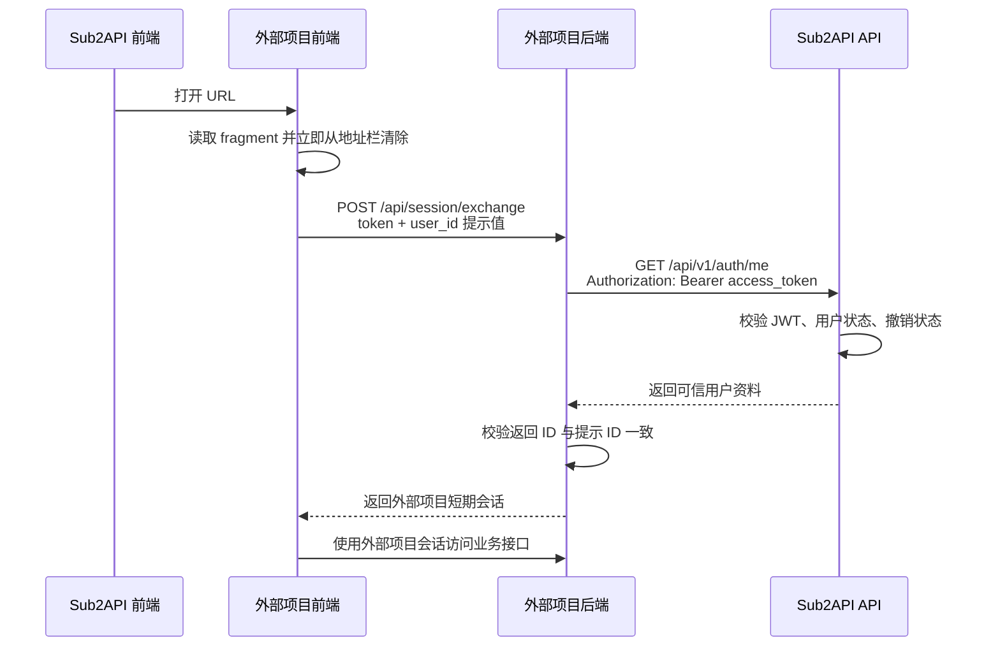

# Sub2API 跨项目认证接入指南

本文面向需要接入 Sub2API 用户身份或管理能力的外部项目，说明当前代码中的
认证协议、安全边界和推荐实现方式。

适用范围：

- 外部用户中心、兑换平台、支付平台等需要识别 Sub2API 当前用户的项目。
- 后端服务需要调用 Sub2API `/api/v1/admin/**` 管理接口的项目。
- 当前仓库中的 `redeem-platform` 可作为参考实现。

不在本文范围内：

- 用户调用模型网关时使用的 `sk-...` API Key。
- OpenAI、Claude、Gemini 等上游供应商的 OAuth Token。
- `sub2api-monitor` 的认证方式。

## 1. 接入结论

Sub2API 当前不是 OAuth/OIDC 身份提供方，也没有 JWKS、公钥验签或标准 Token
Introspection 接口。跨项目认证应采用以下两条独立链路：

### 1.1 用户身份链路

1. Sub2API 前端把当前用户的 Access Token 通过 URL fragment 交给可信外部页面。
2. 外部页面立即清除 fragment，并把 Token 提交给自己的后端。
3. 外部后端携带该 Token 调用 Sub2API `GET /api/v1/auth/me`。
4. Sub2API 完成签名、过期时间、用户状态、撤销状态等检查并返回可信用户信息。
5. 外部后端签发自己项目的短期会话，后续不再把 Sub2API Token 暴露给业务页面。

这种方式是“远程校验后换发本地会话”，不是多个项目共享 JWT 密钥。

### 1.2 服务间管理链路

后端服务调用 `/api/v1/admin/**` 时优先使用 Admin API Key：

```http
x-api-key: <admin-api-key>
```

管理员 JWT 只适合人工登录或一次性初始化，不适合作为长期机器凭证。

## 2. Token 类型

| 名称 | 格式 | 签发方 | 用途 | 是否交给外部项目 |
| --- | --- | --- | --- | --- |
| Access Token | 标准 JWT | Sub2API | 调用用户接口，也可作为管理员登录令牌 | 只交给可信项目，且只用于身份交换 |
| Refresh Token | `rt_` 开头的随机字符串 | Sub2API | 轮换 Access Token | 不交给外部项目 |
| 外部项目会话 | 由外部项目自行定义 | 外部项目 | 访问外部项目自己的接口 | 仅在外部项目内使用 |
| Admin API Key | 不透明密钥 | Sub2API | 服务间调用管理接口 | 仅保存在外部项目后端 |

管理员 JWT 不是单独的 Token 类型。它就是 `role=admin` 用户登录后获得的 Sub2API
Access Token。

## 3. Sub2API Access Token

### 3.1 签发

登录入口：

```http
POST /api/v1/auth/login
Content-Type: application/json
```

```json
{
  "email": "user@example.com",
  "password": "password",
  "turnstile_token": ""
}
```

普通登录成功响应：

```json
{
  "code": 0,
  "message": "success",
  "data": {
    "access_token": "<jwt>",
    "refresh_token": "rt_<opaque-token>",
    "expires_in": 86400,
    "token_type": "Bearer",
    "user": {
      "id": 123,
      "email": "user@example.com",
      "role": "user"
    }
  }
}
```

`expires_in` 以秒为单位，实际值由部署配置决定。

如果用户启用了 TOTP，第一次登录不会返回 Access Token，而会返回：

```json
{
  "code": 0,
  "message": "success",
  "data": {
    "requires_2fa": true,
    "temp_token": "<temporary-token>",
    "user_email_masked": "u***@example.com"
  }
}
```

调用方还需完成：

```http
POST /api/v1/auth/login/2fa
Content-Type: application/json
```

```json
{
  "temp_token": "<temporary-token>",
  "totp_code": "123456"
}
```

跨项目 SSO 一般不应让外部项目收集 Sub2API 用户密码。推荐让用户先在 Sub2API
登录，再从 Sub2API 菜单进入外部项目。

### 3.2 Claims

当前 Access Token 使用 `JWT_SECRET` 和 HS256 签名，主要 Claims 如下：

| Claim | 含义 |
| --- | --- |
| `user_id` | Sub2API 用户 ID |
| `email` | 签发时的用户邮箱 |
| `role` | 签发时的用户角色 |
| `token_version` | 密码变化等场景下用于撤销旧 Token |
| `sid` | 会话或 Refresh Token 家族 ID |
| `bnd` | 可选的 IP/User-Agent 会话指纹 |
| `iat` | 签发时间 |
| `nbf` | 生效时间 |
| `exp` | 过期时间 |

当前 Token 没有设置 `iss` 和 `aud`，不能把它当作面向任意第三方的标准 OIDC
ID Token。

### 3.3 服务端验证内容

Sub2API JWT 中间件会执行以下检查：

1. `Authorization` 必须使用 Bearer 格式，Token 长度不能超过 8192 字节。
2. 校验 HMAC 签名、`exp` 和 `nbf`。
3. 根据 `user_id` 重新查询数据库，不直接信任 JWT 中的用户资料和角色。
4. 用户必须存在且处于有效状态。
5. `token_version` 必须与数据库中的当前值一致。
6. 启用会话绑定时，IP/User-Agent 指纹必须一致。
7. 管理路由还会重新检查当前数据库用户是否为管理员。

因此，外部项目不能只 Base64 解码 Claims 后就信任其中的 `user_id` 或 `role`。

## 4. 用户身份交换

### 4.1 完整时序



### 4.2 为什么使用 fragment

推荐入口格式：

```text
https://external.example.com/#token=<access-token>&user_id=123
```

不要使用：

```text
https://external.example.com/?token=<access-token>&user_id=123
```

注意：当前主前端只有自定义菜单 ID 为 `redeem-center` 时自动选择 fragment；其他
自定义菜单默认仍使用 query。新项目必须先扩展主前端的 fragment 菜单白名单、增加
明确的 `auth_transport` 配置，或实现独立授权入口，不能直接沿用默认 query 行为。

URL fragment 不会随初始 HTTP 请求发送给服务器、反向代理或出现在 Referer 中，
但外部页面加载的 JavaScript 可以读取它。外部页面仍然属于能够接触用户 Access
Token 的高信任组件。

外部前端读取后必须立即删除敏感 fragment：

```js
const url = new URL(window.location.href)
const params = new URLSearchParams(url.hash.replace(/^#/, ''))
const sourceToken = params.get('token') || ''
const hintedUserID = params.get('user_id') || ''

params.delete('token')
params.delete('user_id')
history.replaceState(
  null,
  '',
  `${url.pathname}${url.search}${params.size ? `#${params}` : ''}`,
)
```

随后通过 HTTPS POST 请求提交给外部项目自己的后端。不得写入日志、错误上报、
分析平台、Local Storage 或可持久化数据库。

### 4.3 外部后端验证用户

外部后端调用：

```http
GET /api/v1/auth/me HTTP/1.1
Host: sub2api.example.com
Accept: application/json
Authorization: Bearer <user-access-token>
```

成功响应的 `data.id` 是可信用户 ID。URL 或请求体里的 `user_id` 只能作为提示值，
必须与 `data.id` 比较，不能直接作为登录身份。

Node.js 示例：

```js
export async function verifySub2APIUser(baseURL, accessToken) {
  if (!accessToken || accessToken.length > 8192) {
    throw new Error('USER_TOKEN_REQUIRED')
  }

  const response = await fetch(`${baseURL}/api/v1/auth/me`, {
    headers: {
      Accept: 'application/json',
      Authorization: `Bearer ${accessToken}`,
    },
    signal: AbortSignal.timeout(10_000),
  })
  const body = await response.json().catch(() => ({}))

  if (!response.ok || body?.code !== 0 || !body?.data?.id) {
    const error = new Error('SUB2API_USER_TOKEN_INVALID')
    error.status = response.status
    error.reason = body?.reason || body?.code || ''
    throw error
  }

  return {
    id: Number(body.data.id),
    email: String(body.data.email || ''),
    username: String(body.data.username || ''),
  }
}
```

不要把 Access Token、完整响应体或带有 `Authorization` 的请求头写入日志。

### 4.4 换发外部项目会话

完成 `/auth/me` 验证后，外部项目应签发仅供自己使用的短期会话：

- 使用独立于 `JWT_SECRET` 的密钥，例如 `EXTERNAL_SESSION_SECRET`。
- 建议有效期不超过 15 分钟。
- 至少包含 `iss`、`aud`、`sub`、`iat`、`exp` 和随机 `jti`。
- `sub` 使用 `/auth/me` 返回的用户 ID。
- 不复制 Sub2API 的管理员角色或其他高权限 Claims。
- 每次验证都检查签名、`iss`、`aud` 和 `exp`。

同站点页面优先使用 `HttpOnly; Secure; SameSite=Lax` Cookie。跨站 iframe 可能受
第三方 Cookie 策略影响，此时可以使用短期 Bearer 会话和 `sessionStorage`，但必须
配合严格 CSP、输出转义和 XSS 防护。

外部项目会话存续期间通常不会再次查询 Sub2API，因此用户禁用、改密或撤销会话
最多会有一个本地会话 TTL 的传播延迟。高敏操作应重新调用 `/auth/me`，或要求最近
一次身份校验仍在更短的安全窗口内。

### 4.5 Refresh Token

外部项目不得接收、保存或使用 Sub2API Refresh Token。Refresh Token 只应由
Sub2API 自身前端调用：

```http
POST /api/v1/auth/refresh
Content-Type: application/json
```

```json
{
  "refresh_token": "rt_<opaque-token>"
}
```

每次刷新都会轮换 Refresh Token，旧值立即失效。外部项目本地会话过期后，应让
用户从 Sub2API 重新进入，或通过受控页面流程接收新的 Access Token。

## 5. 会话绑定兼容性

Sub2API 的 `session_binding_enabled` 设置默认关闭。开启后，Access Token 会绑定
登录时的客户端 IP 和 User-Agent。

当前身份交换模式中，`/auth/me` 是由外部项目后端发起的。Sub2API 看到的是外部
服务器的 IP 和 HTTP 客户端 User-Agent，而不是用户登录 Sub2API 时的浏览器指纹，
因此会返回：

```text
HTTP 401
SESSION_BINDING_MISMATCH
```

并撤销该会话家族。

使用当前对接方式时，应保持 `session_binding_enabled=false`。不要直接信任并转发
客户端可伪造的 `X-Forwarded-For` 来绕过会话绑定。

如果生产环境必须启用会话绑定，应先在 Sub2API 增加专用的一次性授权码交换接口：

1. Sub2API 为指定外部项目签发短期、单次使用的随机授权码。
2. 浏览器只把授权码交给外部项目，不传递主站 Access Token。
3. 外部后端使用项目凭证和授权码向 Sub2API 换取用户身份。
4. Sub2API 校验授权码的目标项目、过期时间和单次使用状态。

这属于未来改造方向，当前代码尚未实现。

## 6. 服务间管理认证

### 6.1 Admin API Key

所有 `/api/v1/admin/**` 路由支持：

```http
x-api-key: <admin-api-key>
```

这是当前推荐的服务间认证方式。Admin API Key 具有以下特征：

- 全局单例，不按调用方分别签发。
- 拥有完整管理员权限，没有 scope 或接口级授权。
- 映射为数据库中的第一个有效管理员，用于权限上下文和审计。
- 重新生成或删除后旧 Key 立即失效。
- 完整 Key 只在重新生成时返回一次。

因为权限范围很大，生产部署必须在 Sub2API 前增加反向代理限制：

- 只允许外部项目的固定出口 IP 或私有网络访问。
- 只放行该项目实际需要的方法和路径。
- 默认拒绝其他 `/api/v1/admin/**` 路由。
- 对请求头和响应日志进行脱敏。

例如外部兑换项目的最小白名单可以是：

```text
GET  /api/v1/auth/me
GET  /api/v1/admin/groups/all
POST /api/v1/admin/redeem-codes/create-and-redeem
```

### 6.2 管理员 JWT 备选

管理接口也支持：

```http
Authorization: Bearer <admin-access-token>
```

后端会在普通 JWT 校验之外重新查询用户并检查管理员角色。管理员 JWT 会过期、
可以被改密撤销，也可能受 IP/User-Agent 会话绑定影响，不适合作为长期服务凭证。

如果请求同时携带 `x-api-key` 和 `Authorization`，Sub2API 优先验证 `x-api-key`；
无效的 `x-api-key` 不会回退到 JWT。

### 6.3 当前 Compose 初始化方式

仓库中的 `redeem-bootstrap` 展示了推荐的初始化过程：

1. 使用管理员邮箱和密码调用 `/api/v1/auth/login`，取得临时管理员 JWT。
2. 如有需要，完成管理员合规确认。
3. 使用管理员 JWT 调用 Admin API Key 重新生成接口。
4. 把返回的 Key 写入仅服务端可读的共享卷。
5. 外部服务后续读取该 Key，不再依赖管理员 JWT。

自动初始化不支持启用 TOTP 的管理员账号。生产系统可以改为人工生成并通过密钥
管理系统分发 Admin API Key。

## 7. 错误处理

调用方必须同时判断 HTTP 状态码和响应体，不要只判断其中之一。用户身份校验常见
错误包括：

| HTTP | 原因 | 外部项目处理 |
| --- | --- | --- |
| `401` | `UNAUTHORIZED` / `INVALID_AUTH_HEADER` | 清除本地会话，要求重新进入 |
| `401` | `INVALID_TOKEN` | 清除本地会话，不重试同一个 Token |
| `401` | `TOKEN_EXPIRED` | 要求从 Sub2API 重新进入 |
| `401` | `TOKEN_REVOKED` | 清除本地会话，要求重新登录 |
| `401` | `USER_NOT_FOUND` / `USER_INACTIVE` | 拒绝登录，不创建本地用户会话 |
| `401` | `SESSION_BINDING_MISMATCH` | 停止重试，检查会话绑定兼容性 |
| `429` | 频率限制 | 遵守 `Retry-After`，使用退避重试 |
| `5xx` | Sub2API 暂时不可用 | 不签发本地会话，可进行有限退避重试 |

身份校验失败时，不要降级为信任 URL 中的 `user_id`，也不要使用上一次缓存的用户
身份创建新会话。

## 8. 安全要求

### 8.1 禁止事项

- 不向外部项目共享 `JWT_SECRET`。这是对称密钥，获得它的项目也能伪造管理员 JWT。
- 不在浏览器、HTML、前端构建变量、URL query 或 Local Storage 中保存 Admin API Key。
- 不向外部项目发送 Refresh Token。
- 不把 JWT Claims 的本地解码结果直接当作可信身份。
- 不在日志、Tracing、错误上报、分析事件或数据库中保存完整 Token。
- 不把管理员 JWT 当作永久服务账号 Token。
- 不通过客户端提供的 `user_id`、邮箱或角色直接执行管理操作。

### 8.2 必须措施

- 所有生产链路使用 HTTPS。
- 外部项目后端设置请求超时并限制 Token 最大长度。
- 外部项目使用独立的本地会话密钥并建立轮换机制。
- 对交换接口实施 IP 和身份维度限流。
- 页面使用严格 CSP，并避免加载不受控第三方脚本。
- Admin API Key 使用密钥文件或 Secret Manager 注入。
- 管理写接口使用稳定的 `Idempotency-Key`，重试时保持请求体不变。
- 对外部项目设置最小管理路由白名单和固定网络来源。

## 9. 推荐配置

外部项目至少需要以下配置：

```dotenv
SUB2API_BASE_URL=https://sub2api.example.com

# 服务端管理调用；优先使用文件或 Secret Manager
SUB2API_ADMIN_API_KEY_FILE=/run/secrets/sub2api-admin-api-key

# 外部项目自己的会话密钥，不得与 JWT_SECRET 相同
EXTERNAL_SESSION_SECRET=<at-least-32-random-characters>
EXTERNAL_SESSION_TTL_SECONDS=900

# 网络与超时
SUB2API_REQUEST_TIMEOUT_MS=10000
TRUST_PROXY=false
```

只有不需要管理接口的项目才可以省略 Admin API Key。

## 10. 接入验收清单

上线前至少验证：

- [ ] 主站 Token 只通过 fragment 传递，query 中出现 Token 时立即拒绝。
- [ ] 外部页面读取 Token 后立即从地址栏和历史记录中清除。
- [ ] 外部后端只以 `/api/v1/auth/me` 返回的 `data.id` 为可信用户 ID。
- [ ] 提示 `user_id` 与真实用户不一致时返回 `403`。
- [ ] 无效、过期、撤销和已禁用用户的 Token 都不能创建本地会话。
- [ ] Sub2API 不可用时不会降级为匿名身份或缓存身份。
- [ ] 外部本地会话在设定 TTL 后失效。
- [ ] Access Token、Refresh Token 和 Admin API Key 不出现在日志中。
- [ ] Admin API Key 不会进入浏览器响应、HTML 或前端存储。
- [ ] 反向代理只允许约定的管理路由和来源网络。
- [ ] 已确认 `session_binding_enabled` 与当前身份交换模式兼容。
- [ ] 管理写请求具备幂等键和超时重试策略。

## 11. 当前参考实现

仓库中的对应代码：

| 功能 | 文件 |
| --- | --- |
| JWT Claims、签发、验证、刷新 | `backend/internal/service/auth_service.go` |
| 用户 JWT 中间件 | `backend/internal/server/middleware/jwt_auth.go` |
| 管理员 JWT / Admin API Key 中间件 | `backend/internal/server/middleware/admin_auth.go` |
| 会话 IP/UA 绑定 | `backend/internal/server/middleware/session_binding.go` |
| 登录、刷新、`/auth/me` 路由 | `backend/internal/server/routes/auth.go` |
| 主前端 fragment URL 构造 | `frontend/src/utils/embedded-url.ts` |
| 兑换页读取和清除 fragment | `redeem-platform/public/user.js` |
| 兑换平台调用 `/auth/me` | `redeem-platform/src/sub2api-client.mjs` |
| 兑换平台短会话 | `redeem-platform/src/security.mjs` |
| Admin API Key 自动初始化 | `deploy/localized/bootstrap-redeem.mjs` |

管理员权益发放、幂等和最小路由白名单的详细说明见
[`ADMIN_TOKEN_API_INTEGRATION_CN.md`](./ADMIN_TOKEN_API_INTEGRATION_CN.md)。

仓库内 `redeem-platform` 使用 JWT 的具体实现见
[`../redeem-platform/AUTH_INTEGRATION_EXAMPLE_CN.md`](../redeem-platform/AUTH_INTEGRATION_EXAMPLE_CN.md)。
