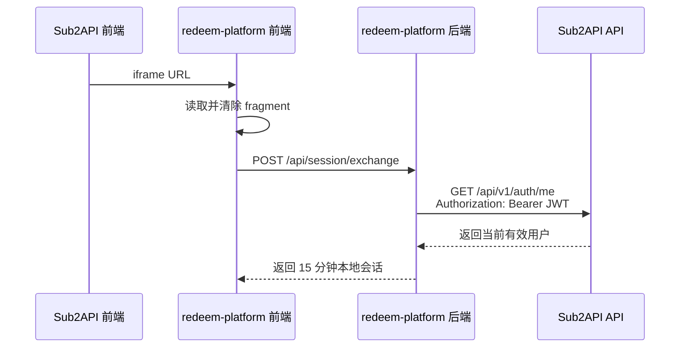

# `redeem-platform` JWT 使用说明

本文只说明 `redeem-platform` 如何使用 Sub2API JWT。

## 1. 结论

`redeem-platform` 不共享 Sub2API 的 `JWT_SECRET`，也不在本地验证 Sub2API JWT
签名。它把用户 JWT 交回 Sub2API 的 `/api/v1/auth/me` 验证，验证成功后再签发
兑换平台自己的短期会话。



## 2. JWT 从哪里来

用户先登录 Sub2API。主前端打开 ID 为 `redeem-center` 的自定义菜单时，通过
`buildEmbeddedUrl` 把当前用户 ID 和 Access Token 放进 iframe URL fragment：

```text
https://redeem.example.com/#user_id=123&token=<sub2api-access-token>
```

对应代码：

- `frontend/src/views/user/CustomPageView.vue`
- `frontend/src/utils/embedded-url.ts`

当前只有菜单 ID 为 `redeem-center` 时使用 fragment；其他自定义菜单默认使用
query。这是主前端针对兑换平台的特殊处理。

Fragment 不会随初始 HTTP 请求发送给兑换平台服务器或反向代理，但兑换页面的
JavaScript 可以读取它。

## 3. 前端如何处理 JWT

`redeem-platform/public/user.js` 在页面加载后读取 fragment：

```js
const url = new URL(window.location.href)
const fragment = new URLSearchParams(url.hash.replace(/^#/, ''))
const sourceToken = fragment.get('token') || ''
const hintedUserID = fragment.get('user_id') || ''
```

读取后立即删除 `token` 和 `user_id`，避免凭证继续留在地址栏和浏览器历史中：

```js
fragment.delete('token')
fragment.delete('user_id')
const remainingFragment = fragment.toString()

history.replaceState(
  null,
  '',
  `${url.pathname}${url.search}${remainingFragment ? `#${remainingFragment}` : ''}`,
)
```

随后把 JWT POST 给兑换平台自己的后端：

```http
POST /api/session/exchange
Content-Type: application/json
```

```json
{
  "token": "<sub2api-access-token>",
  "user_id": "123"
}
```

兑换平台明确拒绝从 URL query 接收 `token` 或 `access_token`，返回：

```text
HTTP 400
UNSAFE_TOKEN_TRANSPORT
```

## 4. 后端如何验证 JWT

交换端点位于 `redeem-platform/src/http-app.mjs`：

```js
if (method === 'POST' && url.pathname === '/api/session/exchange') {
  const body = await readJSON(req)
  const user = await service.exchangeUserToken(body.token, body.user_id)
  const sessionToken = createSessionToken(
    user,
    config.sessionSecret,
    config.sessionTTLSeconds,
  )

  return sendJSON(res, config, 200, {
    session_token: sessionToken,
    expires_in: config.sessionTTLSeconds,
    user,
  })
}
```

`exchangeUserToken` 首先限制 JWT 长度不超过 8192 字节，然后调用
`Sub2APIClient.verifyUser`。

`verifyUser` 把用户 JWT 原样放进 Bearer Header，调用 Sub2API：

```http
GET /api/v1/auth/me
Accept: application/json
Authorization: Bearer <sub2api-access-token>
```

对应实现位于 `redeem-platform/src/sub2api-client.mjs`：

```js
const response = await fetch(`${baseURL}/api/v1/auth/me`, {
  headers: {
    Accept: 'application/json',
    Authorization: `Bearer ${accessToken}`,
  },
  signal: AbortSignal.timeout(timeoutMs),
})
```

Sub2API 会验证：

- JWT HMAC 签名。
- `exp` 和 `nbf`。
- JWT 中的用户是否仍然存在。
- 用户是否处于有效状态。
- Token 是否因改密等操作被撤销。
- 启用会话绑定时，IP/User-Agent 指纹是否一致。

兑换平台只在响应成功、`code=0` 且存在 `data.id` 时接受身份，并只保留：

```js
{
  id: Number(body.data.id),
  email: String(body.data.email || ''),
  username: String(body.data.username || ''),
}
```

URL fragment 中的 `user_id` 只是提示值。它必须和 `/auth/me` 返回的真实用户 ID
一致，否则兑换平台返回：

```text
HTTP 403
USER_ID_MISMATCH
```

## 5. 验证后不再使用主站 JWT

Sub2API JWT 验证成功后，兑换平台使用独立的 `REDEEM_SESSION_SECRET` 签发本地
短会话，默认有效期由以下配置决定：

```dotenv
REDEEM_SESSION_TTL_SECONDS=900
```

本地会话包含 `iss`、`aud`、`sub`、`email`、`username`、`iat`、`exp` 和随机
`jti`。其中 `sub` 使用 `/auth/me` 返回的真实用户 ID。

需要特别区分：当前兑换平台本地会话是两段式 `payload.signature` HMAC Token，
不是标准三段 JWT。其签发和验证代码位于 `redeem-platform/src/security.mjs`。

本地会话保存在浏览器 `sessionStorage`：

```js
sessionStorage.setItem('sub2api.redeem.session', sessionToken)
```

后续调用兑换平台自己的接口时使用：

```http
Authorization: Bearer <redeem-platform-session-token>
```

用户原始 Sub2API JWT 不会保存到 `sessionStorage`，也不会继续用于兑换平台的业务
接口。

## 6. 管理员 JWT 的用法

`redeem-platform` 还支持可选环境变量：

```dotenv
SUB2API_ADMIN_JWT=<sub2api-admin-access-token>
```

当没有配置 Admin API Key 时，兑换平台调用 Sub2API 管理接口会使用：

```http
Authorization: Bearer <sub2api-admin-access-token>
```

代码位于 `Sub2APIClient.adminHeaders`：

```js
if (this.adminApiKey) headers['x-api-key'] = this.adminApiKey
else headers.Authorization = `Bearer ${this.adminJWT}`
```

因此 Admin API Key 的优先级高于管理员 JWT。管理员 JWT 会过期，也可能受到
IP/User-Agent 会话绑定影响，只是备选方式；当前 Compose 部署在初始化后使用
Admin API Key，不会长期依赖管理员 JWT。

## 7. Refresh Token

兑换平台不接收、不保存、也不使用 Sub2API Refresh Token。

Access Token 过期后，兑换平台不会自行调用 `/api/v1/auth/refresh`。本地短会话失效
时，用户需要从 Sub2API 重新进入兑换中心，由主前端提供当前有效的 Access Token。

## 8. 会话绑定限制

如果 Sub2API 开启 `session_binding_enabled`，JWT 会绑定用户登录时的浏览器 IP 和
User-Agent。

兑换平台是由服务端调用 `/auth/me`，Sub2API 看到的 IP 和 User-Agent 与用户浏览器
不同，因此当前 JWT 交换流程会返回：

```text
HTTP 401
SESSION_BINDING_MISMATCH
```

使用当前兑换平台 JWT 对接方式时，需要保持 `session_binding_enabled=false`。

## 9. 安全边界

- `redeem-platform` 不需要也不能获得 Sub2API 的 `JWT_SECRET`。
- 只把用户 Access Token 交给可信的兑换平台前端和后端。
- 不向兑换平台传递 Refresh Token。
- 不信任本地解码的 JWT Claims，只信任 `/auth/me` 的成功响应。
- 不记录用户 JWT、管理员 JWT 或完整 `Authorization` Header。
- 不把用户 JWT 放进 URL query、Local Storage 或业务数据库。
- 兑换平台本地会话使用独立密钥，不能复用 Sub2API `JWT_SECRET`。
- 本地会话有效期间，Sub2API 用户禁用或 Token 撤销最多存在 15 分钟传播延迟。

## 10. 代码位置

| JWT 使用环节 | 文件 |
| --- | --- |
| 主前端构造 fragment | `frontend/src/views/user/CustomPageView.vue` |
| URL 参数构造 | `frontend/src/utils/embedded-url.ts` |
| 读取并清除用户 JWT | `redeem-platform/public/user.js` |
| JWT 交换入口 | `redeem-platform/src/http-app.mjs` |
| 用户 ID 一致性检查 | `redeem-platform/src/redemption-service.mjs` |
| 调用 Sub2API `/auth/me` | `redeem-platform/src/sub2api-client.mjs` |
| 签发兑换平台本地会话 | `redeem-platform/src/security.mjs` |
| JWT 相关配置 | `redeem-platform/src/config.mjs` |
| 安全回归测试 | `redeem-platform/test/security-regressions.test.mjs` |
| HTTP 交换测试 | `redeem-platform/test/http-app.test.mjs` |
