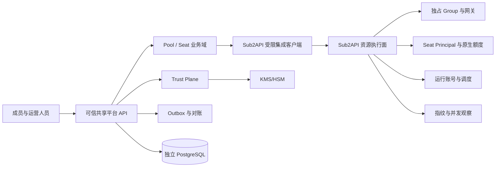

# 系统架构与边界说明

## 1. 目标

本系统在不复制 Sub2API 资源执行能力的前提下，为固定规模可信成员提供 Pool、Seat、暂停换员、
风险观察和离线恢复治理。MVP 首先保证状态一致、额度连续、暂停不可绕过和恢复材料可验证，
不追求公开市场与完整交易闭环。

## 2. 实现阶段

- Phase 1（已完成原型）：内存领域协调器、凭据批次加密、风险聚合，以及 Sub2API 受限
  provision/register/suspend/drain/freeze/rotate/usage-risk 资源路由。
- Phase 2-A（已完成开发接线）：PostgreSQL Provision/Operation/Seat/Owner/Claim、数据库租约与 fencing、
  KMS 包络 adapter 边界、迁移 runner、readiness 和恢复 worker。
- Phase 2-B（已完成开发接线）：持久化暂停、排空、冻结与重启对账。
- Phase 2-C（已完成开发接线）：持久化临时换员、正式成员恢复、加密 Claim 与重启对账。
- Phase 2-D（已完成开发接线）：持久化 pending settlement 查询、解除 intent、审计和重启恢复。
- Phase 2-E（已完成开发接线）：持久化 Credential Batch Seal/Get/Activate/Retire；同一 DEK 使用在线 KMS
  与独立 Recovery wrap-only adapter 双包装。
- Phase 2-F（已完成开发接线）：Pool 全 Seat Recovery 治理准备闭环 foundation，覆盖 BOOTSTRAP/ROTATE、外部
  Root/VSS、加密 Share、JCS Manifest、签名/ACK、STAGED batch、逐账号 evidence 和 READY。生产 providers、
  Pool finalize 和用户会话/RBAC 继续失败关闭。
- Phase 2-G（已完成开发接线）：Pool 全 Seat prepare/activate-held/commit-release、平台结构切换、恢复 worker、一次性
  replacement claim 和 Sub2API 网关 credential fingerprint gate。生产 providers 和最终用户/RBAC 仍失败关闭。
- Phase 2-H H1（当前）：公开无秘密的 JCS Evidence Bundle、纯离线 verifier、受 recovery key 保护的
  持久导出/下载路由和 Reveal 授权 transcript 基础。生产导出 signer、Reveal API 与所有
  decrypt/reconstruct/unwrap/plaintext executor 均未接线。
- Phase 3（范围外）：公开交易、支付结算、多供应商与跨地域高可用。

以下逻辑架构描述 Phase 2 完成后的目标；各阶段真实能力以阶段状态文档为准。

## 3. 逻辑架构



## 4. 职责边界

### 4.1 Sub2API 资源执行面

- 保存和刷新供应商运行凭据，执行账号健康检查与调度。
- 为每个 Pool 建立独占 Group。
- 为每个 Seat 建立稳定的 Seat Principal、UserSubscription 和可轮换 API Key。
- 使用现有小时、日、周、月额度和 RPM 限制完成网关准入与用量结算。
- 在网关入口检查 Seat 暂停状态和 `assignment_epoch`。
- 网关准入先登记可续租的严格并发租约，再重读 Seat gate，并原子创建持久
  `pending_settlement`；可信 Seat 的用量必须在 HTTP 返回和租约释放前同步结算。
- 只有连续两次严格并发读数为 0 且 `pending_settlements=0` 时才允许冻结；结算错误、panic、
  超时或屏障删除失败均保留 pending 并失败关闭。
- 遗留 pending 通过受限 settlement 查询与 resolve API 处理：按 Seat、Epoch、settlement ID、请求 ID
  和计费幂等证据核对；resolve 需要独立 `settlement:resolve` scope，在同一事务追加不可变审计后
  删除精确 pending。接口不会替代实际补账或上游结果核查，禁止通过数据库直改绕过。
- drain-status 与 freeze 返回小时、日、周、月四个原生额度窗口的 `usage_snapshot`；未启动窗口的
  `window_starts` 保持 null，不能用快照时间代填。
- 拒绝可信 Seat 提交异步图片、批量图片和视频任务，防止任务在 HTTP 请求结束后继续计费并逃逸冻结。
- 聚合实时并发、IP 和 User-Agent 组合特征等风险代理信号；该组合特征不等同于真实设备指纹。

### 4.2 新平台业务面

- 维护 Pool、Seat、业务成员和 Seat Assignment。
- 编排暂停、排空、冻结、临时换员、永久换员和恢复。
- 保存期望状态，并通过幂等操作查询 Sub2API 的实际状态。
- 展示风险信号，支持人工处置；风险信号不能直接改变成员权利。
- 接收客户端或可信采集端上报的设备指纹，仅保存带密钥 HMAC 后的摘要；不得把 Sub2API 的
  IP 与 User-Agent 组合特征当作经过设备证明的指纹。
- 维护 Membership Epoch、密钥批次、Manifest、Share 投递和可信审计。

### 4.3 数据所有权

| 数据 | 唯一事实来源 |
|---|---|
| Pool、Seat、成员与 Assignment | 新平台 |
| Group、Account、Seat Principal、Subscription、API Key | Sub2API |
| 实际用量、窗口起点、实时并发 | Sub2API |
| 暂停/换员业务原因与审批 | 新平台 |
| 网关当前阻断状态 | Sub2API |
| Membership Epoch、密钥批次、Manifest、Share | 新平台 Trust Plane |
| 集成命令期望状态 | 新平台 |
| 集成命令实际执行结果 | Sub2API，回写新平台快照 |

两个系统不得共享数据库用户、表或事务。跨系统一致性依靠幂等命令、outbox 和周期性对账，
不使用分布式事务。

## 5. Seat Principal 决策

Seat Principal 是 Sub2API 中不允许交互登录的系统主体。它随 Seat 创建，在成员换位时保持不变。
UserSubscription 与 Seat Principal 绑定，因此换员不需要复制用量或重建额度窗口。

Phase 1 的 `POST /api/v1/seats` 已通过受限 provision API 在既有独占 Group 中原子创建 Principal、
Subscription 和 API Key；Group 与运行账号仍须管理员预先准备。平台只在 Sub2API 明确返回 ACTIVE 后
创建本地 Seat。上游超时或结果未知时本地不存在可用 Seat，调用方以相同内容和同一 operation_id 重放，
Sub2API 通过幂等记录恢复同一 credential；平台只在首次成功响应暴露绑定 owner 的一次性 claim token，
内部仅保存 token SHA-256 摘要和短期到期时间。重放不会恢复 token 明文。

成员获得的是 Seat 当前版本的调用凭据或短期能力，不获得 Seat Principal 的登录能力。暂停时禁用旧
API Key；冻结确认后生成新版本并交给新成员。旧凭据即使仍被持有，也会因禁用和 epoch 不匹配而失败。

Sub2API `access_credential_rotated=true` 只证明 Seat 访问 Key 已轮换。Phase 2-F Recovery plan 要求每个
权威账号在旧、新相邻 Epoch 各精确绑定 `LOGIN`、`MFA`、`RECOVERY`、`OWNERSHIP` 四类批次，并由
外部 attestation verifier 验证账号控制权轮换证明。该证据、Root/Share/Manifest 和全 Seat 冻结材料共同
绑定在 plan 中；旧独立 `control-rotation-evidence` 入口不能绕过 ceremony。

Phase 2-G finalize 在 Sub2API 仍保持 held 时，以 Serializable 事务提升 Pool 最小 Membership Epoch、切换
Owner、激活新批次并退休旧批次；远端 commit 证明持久后才允许签发 replacement claim token。

该设计是 MVP 的稳定性基线。不得在业务层把额度重新实现为第二套账本。

## 6. 身份与认证

- 用户从 Sub2API 进入新平台时，Access Token 只通过 URL fragment 交付。
- 新平台后端调用 Sub2API `/api/v1/auth/me` 验证后签发自己的短会话。
- fragment 中的用户 ID 仅是提示值，身份以 `/auth/me` 响应为准。
- Refresh Token、Admin API Key 和集成密钥不得进入浏览器。
- 服务间调用使用独立 integration client；凭据应具备 scope、过期时间和轮换能力。
- 高风险操作必须重新验证用户身份，并记录操作者与理由。

## 7. 集成一致性

当前每个写命令携带最长 128 字符的稳定 `operation_id` 和外部实体 ID，不要求使用 UUID。
Sub2API 对高风险 suspend 在本地事务中保存操作 epoch：后续 epoch 未变化时允许安全重放，epoch
变化后稳定返回冲突且无副作用，具体规则见 `domain-model.md` 的核心不变量。完整的
`expected_assignment_epoch + request_hash + response_snapshot` 操作账本是 Phase 2 目标，不能描述为当前能力。

新平台操作状态：

```text
RUNNING -> SUCCEEDED
        -> RETRYABLE -> SUCCEEDED
        -> RECONCILE_REQUIRED
        -> FAILED
```

暂停操作采用 fail-closed 语义：未获得冻结确认时不得继续换员。网络超时不能推断执行失败，必须查询
`operation_id` 或 Seat 状态完成判定。

临时换员和恢复同样采用持久聚合：操作先锁定 FROZEN Seat、当前 Assignment、目标成员、冻结证据及
稳定 Sub2API 资源 ID，再调用上游轮换。明确成功后，旧 Assignment 结束、目标 Assignment 激活、
Seat assignment epoch/API Key version 同步加一、Operation 成功和加密 Claim 在一个数据库事务提交。
Membership Epoch 与正式 Owner 不变；普通 4xx 不能证明上游未应用时进入人工复核并保持 Seat 禁用。

Seat provision 不具备可查询的本地 Seat 时，采用同一写命令重放而非先行落本地状态：`RETRYABLE` 操作
保留请求摘要，再次调用相同 operation_id 时重投上游；内容漂移返回冲突。已成功操作的重放直接返回
既有 Seat 和领取状态，不再次调用 Sub2API，也不再次返回 claim token。

Provision credential 的领取使用独立 `credential:ack` scope。平台以确定性的 claim operation ID、owner 和
持久 credential fingerprint 调用 Sub2API；上游明确确认并持久化 typed snapshot 后才继续领取。
超时或响应无法验证时标记 `ACK_RECONCILE_REQUIRED`，保留至 TTL 结束并以同一 ack 操作重放，期间
失败关闭。TTL 到期后即使上游随后返回成功也必须销毁 credential 与 token 摘要，不得交付。

## 8. 范围控制

### 8.1 Phase 2-G Runtime 边界

当前组合根只使用 PostgreSQL `WorkflowStore`，不再回退内存 Coordinator。已接线的纵向链路是
Provision、持久 Seat/Owner Assignment、Operation 查询、Provision credential claim、Suspend/Drain/Freeze、
临时换员、正式恢复，以及 pending settlement 查询和解除。暂停、换员或解除都先提交本地聚合，再调用
Sub2API；恢复 worker 从请求快照和持久工单重建命令。解除使用独立只读/写入 client，成功结果严格绑定
Seat、settlement、epoch、request ID 和 actor；未决解除 intent 会阻止换员。

Credential Batch 使用独立 API Key 和 operation client namespace。Seal 先持久 PREPARED intent，再在事务外
执行双包装，最终以 lease/fence 和 Pool 当前 ACTIVE Epoch 二次核验提交 SEALED；Activate/Retire 使用数据库
CAS 和不可变转换审计。公开元数据不包含任何密文、wrapped DEK、key ref、AAD hash 或内容指纹。

Recovery plan 准备链与 Pool finalize 已有持久 Store 和条件路由，但当前组合根未链接生产 providers，默认
关闭。旧单 Seat Replace 和旧 control rotation evidence 不与持久流程混用，HTTP 返回
`PERSISTENT_WORKFLOW_UNSUPPORTED`。风险聚合保留为非持久观察面，不参与状态转换。完整边界和迁移策略见
[Phase 2-B 暂停运行时状态](phase2b-suspend-status.md)和
[Phase 2-C 换员运行时状态](phase2c-assignment-status.md)。
[Phase 2-D 结算解除运行时状态](phase2d-settlement-status.md)和
[Phase 2-E 凭据批次状态](phase2e-credential-batch-status.md)和
[Phase 2-F Recovery 治理准备闭环状态](phase2f-recovery-governance-status.md)和
[Phase 2-G Pool 级永久换员最终化状态](phase2g-permanent-finalization-status.md)和
[Phase 2-H 离线验证与 Reveal 授权记录基础状态](phase2h-offline-verification-status.md)。

## Phase 2-F Recovery 治理准备边界

Phase 2-F 将恢复治理建模为 Pool 级 ceremony，而不是单 Seat 操作。权威资源账号注册表及账号到 Seat 的显式
多对多映射定义轮换范围；全部 Seat 必须先 `FROZEN`。`BOOTSTRAP` 从迁移后的 `LEGACY_UNVERIFIED`
Epoch 建立第一条可信 Manifest 链，后续 `ROTATE` 只能从完整 CURRENT Epoch 开始。

外部 Root/VSS provider、RFC 8785/JCS canonicalizer、HSM signer、provider attestation verifier、member
signature verifier、governance batch provider 和 `MemberArtifact` gateway 位于 Trust Plane 边界之外。
平台只持久化 public handle、commitment、散列、签名、加密 Share 和去敏状态；Root 私钥、Share 明文、
DEK 和账号凭据明文不得跨入持久层或 HTTP 响应。

Phase 2-F 的历史闭环终点是 plan `READY`；Phase 2-G 已在其后接入 Pool 级 finalize。当前二进制仍未链接
生产 providers，所以默认 `TRUSTED_POOL_RECOVERY_GOVERNANCE_ENABLED=false`，启用会在启动阶段失败。

## Phase 2-G 永久换员一致性边界

Sub2API prepare 生成新 credential 但保持禁用；activate 将其安装到稳定 API Key 后仍保持
`rotation_activated_pending_commit`；平台只在该 held 证明通过后执行本地结构事务，随后 commit 才释放
API Key 和 Subscription。平台持久化 Ed25519 attestation、旧 credential 失效、逐请求 fingerprint gate 和
durable outbox 证据，不能以异步缓存失效冒充准入安全边界。

本地结构提交后进入 `PROVIDER_COMMIT_PENDING`，远端 release 后进入 `READY_TO_ISSUE`。恢复 worker 只重放
provider commit，不能生成 token。同步 finalize 首次提交全部 claim 时才返回 raw token；状态 GET、operation
GET 和幂等重放不披露。领取端点使用 recovery service key，它代表管理员代交付服务，不代表目标成员身份。

## Phase 2-H 离线验证与 Reveal 边界

H1 的 Evidence Bundle 是公开、无秘密的单份严格 JCS JSON。它包含 Manifest 规范字节/散列、平台签名、
成员审批、Share ACK 和 typed provider proof，但不包含 Share ciphertext、批次 ciphertext/nonce、wrapped
DEK、Root/Share 私密材料或 credential。信任策略作为独立输入提供；Bundle 内的 key 不能自我建立信任。

纯离线 verifier 不依赖 HTTP、数据库、KMS 或 provider。旧平台签名没有
`trusted-pool/platform-manifest-signature/v2` domain、或缺 typed proof 时稳定为 `INCOMPLETE`；只有完整
JCS、checkpoint、散列链、集合、动态阈值和 Ed25519 证据通过才为 `VERIFIED`。Reveal transcript 校验即使
达到治理阈值，也只产生 `AUTHORIZED_NOT_EXECUTABLE`。Migration 010、`EvidenceStore` 与 recovery-key
导出路由只发布公开证据；生产 signer 未注入时启动失败，且代码没有任何 decrypt/reconstruct/unwrap executor。

进入 MVP 的需求必须至少直接服务于以下一项：

1. 暂停后换员的一致性。
2. Seat 原生额度连续性。
3. 网关不可绕过的阻断。
4. 分阶段凭据和可信恢复。
5. 上述能力的审计、测试或运维。

公开市场、支付分账、退款担保、自动仲裁、自动风控封禁、硬件证明、多供应商通用框架、跨地域
双活均不在本轮。新增范围必须通过 ADR 明确原因、风险、替代方案和验收变更。
