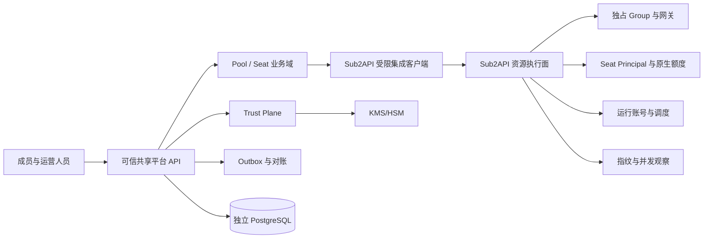

# 系统架构与边界说明

## 1. 目标

本系统在不复制 Sub2API 资源执行能力的前提下，为固定规模可信成员提供 Pool、Seat、暂停换员、
风险观察和离线恢复治理。MVP 首先保证状态一致、额度连续、暂停不可绕过和恢复材料可验证，
不追求公开市场与完整交易闭环。

## 2. 实现阶段

- Phase 1（已完成原型）：内存领域协调器、凭据批次加密、风险聚合，以及 Sub2API 受限
  provision/register/suspend/drain/freeze/rotate/usage-risk 资源路由。
- Phase 2-A（当前）：PostgreSQL Provision/Operation/Seat/Owner/Claim、数据库租约与 fencing、KMS 包络
  adapter 边界、迁移 runner、readiness 和恢复 worker。暂停/换员/settlement/batch 在运行时失败关闭。
- Phase 2-B（下一阶段）：暂停排空、结算对账、临时换员/恢复的持久工作流，以及 outbox、用户会话/RBAC。
- Phase 2-C：Recovery Root、Share、Manifest、生产 KMS/HSM 和永久换员治理。
- Phase 3（范围外）：公开交易、支付结算、多供应商与跨地域高可用。

以下逻辑架构描述 Phase 2 完成后的目标；各阶段真实能力以阶段状态文档为准。

## 3. 逻辑架构



## 4. 职责边界

### 4.1 Sub2API 资源执行面

- 保存和刷新供应商运行凭据，执行账号健康检查与调度。
- 为每个 Pool 建立独占 Group。
- 为每个 Seat 建立稳定的 Seat Principal、UserSubscription 和可轮换 API Key。
- 使用现有小时、日、周、月额度和 RPM 限制完成网关准入与用量结算。
- 在网关入口检查 Seat 暂停状态和 `assignment_epoch`。
- 网关准入先登记可续租的严格并发租约，再重读 Seat gate，并原子创建持久
  `pending_settlement`；可信 Seat 的用量必须在 HTTP 返回和租约释放前同步结算。
- 只有连续两次严格并发读数为 0 且 `pending_settlements=0` 时才允许冻结；结算错误、panic、
  超时或屏障删除失败均保留 pending 并失败关闭。
- 遗留 pending 通过受限 settlement 查询与 resolve API 处理：按 Seat、Epoch、settlement ID、请求 ID
  和计费幂等证据核对；resolve 需要独立 `settlement:resolve` scope，在同一事务追加不可变审计后
  删除精确 pending。接口不会替代实际补账或上游结果核查，禁止通过数据库直改绕过。
- drain-status 与 freeze 返回小时、日、周、月四个原生额度窗口的 `usage_snapshot`；未启动窗口的
  `window_starts` 保持 null，不能用快照时间代填。
- 拒绝可信 Seat 提交异步图片、批量图片和视频任务，防止任务在 HTTP 请求结束后继续计费并逃逸冻结。
- 聚合实时并发、IP 和 User-Agent 组合特征等风险代理信号；该组合特征不等同于真实设备指纹。

### 4.2 新平台业务面

- 维护 Pool、Seat、业务成员和 Seat Assignment。
- 编排暂停、排空、冻结、临时换员、永久换员和恢复。
- 保存期望状态，并通过幂等操作查询 Sub2API 的实际状态。
- 展示风险信号，支持人工处置；风险信号不能直接改变成员权利。
- 接收客户端或可信采集端上报的设备指纹，仅保存带密钥 HMAC 后的摘要；不得把 Sub2API 的
  IP 与 User-Agent 组合特征当作经过设备证明的指纹。
- 维护 Membership Epoch、密钥批次、Manifest、Share 投递和可信审计。

### 4.3 数据所有权

| 数据 | 唯一事实来源 |
|---|---|
| Pool、Seat、成员与 Assignment | 新平台 |
| Group、Account、Seat Principal、Subscription、API Key | Sub2API |
| 实际用量、窗口起点、实时并发 | Sub2API |
| 暂停/换员业务原因与审批 | 新平台 |
| 网关当前阻断状态 | Sub2API |
| Membership Epoch、密钥批次、Manifest、Share | 新平台 Trust Plane |
| 集成命令期望状态 | 新平台 |
| 集成命令实际执行结果 | Sub2API，回写新平台快照 |

两个系统不得共享数据库用户、表或事务。跨系统一致性依靠幂等命令、outbox 和周期性对账，
不使用分布式事务。

## 5. Seat Principal 决策

Seat Principal 是 Sub2API 中不允许交互登录的系统主体。它随 Seat 创建，在成员换位时保持不变。
UserSubscription 与 Seat Principal 绑定，因此换员不需要复制用量或重建额度窗口。

Phase 1 的 `POST /api/v1/seats` 已通过受限 provision API 在既有独占 Group 中原子创建 Principal、
Subscription 和 API Key；Group 与运行账号仍须管理员预先准备。平台只在 Sub2API 明确返回 ACTIVE 后
创建本地 Seat。上游超时或结果未知时本地不存在可用 Seat，调用方以相同内容和同一 operation_id 重放，
Sub2API 通过幂等记录恢复同一 credential；平台只在首次成功响应暴露绑定 owner 的一次性 claim token，
内部仅保存 token SHA-256 摘要和短期到期时间。重放不会恢复 token 明文。

成员获得的是 Seat 当前版本的调用凭据或短期能力，不获得 Seat Principal 的登录能力。暂停时禁用旧
API Key；冻结确认后生成新版本并交给新成员。旧凭据即使仍被持有，也会因禁用和 epoch 不匹配而失败。

Sub2API `access_credential_rotated=true` 只证明 Seat 访问 Key 已轮换。平台只有在同一 Pool/账号的旧
Epoch `LOGIN`、`MFA`、`RECOVERY`、`OWNERSHIP` 批次全部 `RETIRED`，相邻新 Epoch 对应批次
全部 `ACTIVE`，且请求携带运营或外部系统已预先核验的 `provider_attestation_ref` 后，才签发
`control_rotation_evidence_ref`。该证据绑定供应商证明引用和新旧八个批次 ID；Coordinator 在永久
换员前按 Seat Pool、当前 Epoch 和 `current + 1` 复核引用与批次实时状态。Phase 1 只保存引用，不获取
供应商证明，也不校验供应商签名或证明的密码学真实性，不得据此宣称平台验证了供应商动作。

永久换员完成后，Manager 将 Pool 的最小 Membership Epoch 提升到新 Epoch。该写屏障使旧 Epoch
不能再 Seal 或 Activate 控制凭据批次，避免已完成换员后回写旧成员集合的材料。

该设计是 MVP 的稳定性基线。不得在业务层把额度重新实现为第二套账本。

## 6. 身份与认证

- 用户从 Sub2API 进入新平台时，Access Token 只通过 URL fragment 交付。
- 新平台后端调用 Sub2API `/api/v1/auth/me` 验证后签发自己的短会话。
- fragment 中的用户 ID 仅是提示值，身份以 `/auth/me` 响应为准。
- Refresh Token、Admin API Key 和集成密钥不得进入浏览器。
- 服务间调用使用独立 integration client；凭据应具备 scope、过期时间和轮换能力。
- 高风险操作必须重新验证用户身份，并记录操作者与理由。

## 7. 集成一致性

当前每个写命令携带最长 128 字符的稳定 `operation_id` 和外部实体 ID，不要求使用 UUID。
Sub2API 对高风险 suspend 在本地事务中保存操作 epoch：后续 epoch 未变化时允许安全重放，epoch
变化后稳定返回冲突且无副作用，具体规则见 `domain-model.md` 的核心不变量。完整的
`expected_assignment_epoch + request_hash + response_snapshot` 操作账本是 Phase 2 目标，不能描述为当前能力。

新平台操作状态：

```text
RUNNING -> SUCCEEDED
        -> RETRYABLE -> SUCCEEDED
        -> RECONCILE_REQUIRED
        -> FAILED
```

暂停操作采用 fail-closed 语义：未获得冻结确认时不得继续换员。网络超时不能推断执行失败，必须查询
`operation_id` 或 Seat 状态完成判定。

Seat provision 不具备可查询的本地 Seat 时，采用同一写命令重放而非先行落本地状态：`RETRYABLE` 操作
保留请求摘要，再次调用相同 operation_id 时重投上游；内容漂移返回冲突。已成功操作的重放直接返回
既有 Seat 和领取状态，不再次调用 Sub2API，也不再次返回 claim token。

Provision credential 的领取使用独立 `credential:ack` scope。平台以确定性的 claim operation ID、owner 和
持久 credential fingerprint 调用 Sub2API；上游明确确认并持久化 typed snapshot 后才继续领取。
超时或响应无法验证时标记 `ACK_RECONCILE_REQUIRED`，保留至 TTL 结束并以同一 ack 操作重放，期间
失败关闭。TTL 到期后即使上游随后返回成功也必须销毁 credential 与 token 摘要，不得交付。

## 8. 范围控制

### 8.1 Phase 2-A Runtime 边界

当前组合根只使用 PostgreSQL `WorkflowStore`，不再回退内存 Coordinator。已接线的纵向链路是
Provision、持久 Seat/Owner Assignment、Operation 查询和 Provision credential claim。数据库迁移、
KMS 包络、readiness 和恢复 worker 都是启动依赖，任一失败即拒绝启动或请求。

尚未持久化的 Suspend/Assign/Restore/Replace、settlement 和 credential batch 不与内存实现混用，HTTP
统一返回 `PERSISTENT_WORKFLOW_UNSUPPORTED`。风险聚合保留为非持久观察面，不参与状态转换。完整边界和
迁移策略见 [Phase 2-A Runtime 状态](phase2a-runtime-status.md)。

进入 MVP 的需求必须至少直接服务于以下一项：

1. 暂停后换员的一致性。
2. Seat 原生额度连续性。
3. 网关不可绕过的阻断。
4. 分阶段凭据和可信恢复。
5. 上述能力的审计、测试或运维。

公开市场、支付分账、退款担保、自动仲裁、自动风控封禁、硬件证明、多供应商通用框架、跨地域
双活均不在本轮。新增范围必须通过 ADR 明确原因、风险、替代方案和验收变更。
