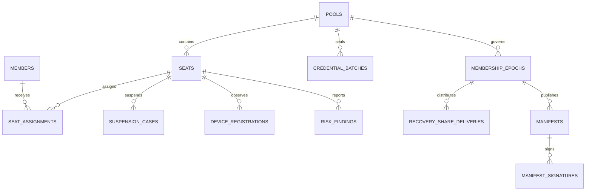

# 领域模型与数据字典

数据库定义以 [`migrations/001_init.sql`](../migrations/001_init.sql) 为准。本文件解释实体语义和跨表不变量。

## 1. 聚合关系

## 2. 核心实体

### `pools`

业务 Pool。`sub2api_group_id` 是 Sub2API 独占 Group 引用，不允许复用给多个 Pool。
`membership_epoch` 只在永久成员集合或恢复根变化时增加，临时换员不增加。
Phase 1 对外使用的字符串 Pool ID 写入 `external_id`（1 至 128 字符）；Phase 2 Repository 通过它
解析内部 UUID，表间关联仍只使用内部 UUID。

### `seats`

稳定席位。`sub2api_principal_id` 和 `sub2api_subscription_id` 在资源侧成功创建后写入，换员时不变。
`assignment_epoch` 每次有效 Assignment 变化或安全失效时增加，用于拒绝旧授权。
公开 Seat ID 同样写入 `external_id`，不会因 Phase 2 迁移而改变；Repository 负责解析为内部 UUID。

### `members`

业务成员映射。`sub2api_user_id` 来源必须是 Sub2API `/auth/me` 的成功响应，不能信任浏览器传值。
Phase 1 的公开成员字符串 ID 写入 `external_id`，与内部 UUID 和可信 `sub2api_user_id` 分列保存。

三个 `external_id` 均为全局唯一、非空且最长 128 字符。迁移时先按公开 ID 幂等建立映射，再迁移
Seat/Assignment 状态；API 和集成事件继续使用公开 ID，禁止把内部 UUID 暴露为替代标识。

### `seat_assignments`

Seat 与成员的历史关系。同一 Seat 只能存在一个 `ACTIVE` Assignment。同一成员在同一 Pool 内也只能
占用一个活动 Seat。表内冗余 `pool_id`，并通过 `(seat_id, pool_id)` 复合外键保证其与 Seat 所属 Pool
一致，再由部分唯一索引约束 `(pool_id, member_id)` 的活动记录。临时 Assignment 不影响正式 Membership Epoch。

### `suspension_cases`

记录暂停理由、排空与冻结快照。只有状态为 `FROZEN` 且 `freeze_snapshot` 非空时，Seat 才能换员。
操作失败或超时而结果不明时 Seat 保持 `SUSPEND_PENDING`，操作记录为 `RECONCILE_REQUIRED`。

### `device_registrations` 与 `risk_findings`

仅保存 HMAC 后的设备指纹和聚合风险结果。最高等级 `SUSPEND` 仍只是人工暂停建议，不触发数据库
自动暂停。设备指纹版本用于密钥和算法轮换。

### `membership_epochs`

记录正式成员集合、治理阈值和密码学恢复阈值。治理批准与密钥重建是不同概念，不能共用单一阈值。

### `credential_batches`

密钥批次元数据和密文。批次类型固定为 `OPERATIONAL`、`LOGIN`、`MFA`、`RECOVERY`、
`OWNERSHIP`。DEK 只能以 KMS 包装后的形式保存。`(pool_id, membership_epoch)` 必须引用该 Pool
真实存在的 Membership Epoch，不能接收游离批次。

### `control_rotation_evidence`

永久换员的平台控制凭据证据。它绑定 Pool、账号引用、相邻的新旧 Membership Epoch、必填的
`provider_attestation_ref`，以及旧 Epoch 已 `RETIRED` 与新 Epoch 已 `ACTIVE` 的 `LOGIN`、`MFA`、
`RECOVERY`、`OWNERSHIP` 八个批次。供应商证明引用必须由运营或外部系统预先核验真实性；Phase 1
只保存不透明引用，不获取证明，也不校验供应商签名或证明的密码学真实性。Coordinator 按 Seat Pool
和相邻 Epoch 复核平台证据，不能接受任意外部引用代替它。

`002_phase2a_persistence.sql` 的旧 `control_rotation_evidence` 不再作为最终化事实来源，旧单 Seat 永久换员入口
继续失败关闭。Phase 2-F/G 使用 `recovery_epoch_plans`、typed control evidence、四类 FROM/TO 批次、Pool 级
provider release 和 permanent finalization ledger；只有该流程达到 `FINALIZED` 才提升 Epoch floor。

### `manifests` 与 `manifest_signatures`

Manifest 绑定一个 Membership Epoch。签名记录同时保存 `manifest_id` 和 `epoch_id`，复合外键保证
签名成员属于该 Manifest 的正式成员快照，临时成员或其他 Epoch 成员不能写入签名记录。

### `integration_operations`

所有跨服务写操作的幂等记录。`operation_id` 是长度不超过 128 字符的稳定不透明标识，不限定为 UUID；
`request_hash` 防止调用方复用 `operation_id` 表达不同意图。

### `trust_events`

只追加审计表。数据库触发器拒绝 UPDATE 和 DELETE；修正记录必须新增补偿事件。

## 3. 关键不变量

1. Pool 与 Sub2API Group 一对一。
2. Seat 与 Seat Principal、UserSubscription 一对一。
3. Seat 只有一个活动 Assignment。
4. Seat 未到 `FROZEN` 不得创建新的活动 Assignment。
5. 暂停开始时必须由 Sub2API 立即阻断旧授权，不能等待排空结束才失效。
6. 临时成员不出现在 Membership Epoch 的正式成员快照中。
7. 永久换员后必须产生新 Membership Epoch 和新 Credential Batch 版本。
8. 原始设备指纹、API Key、凭据明文和未包装 DEK 不进入数据库。
9. 后续 Membership Epoch 未变化时，相同已完成操作可以重放原结果；Epoch 变化后，旧操作必须稳定
   返回冲突且不产生任何副作用。
10. 可信审计不允许覆盖或删除。

## 4. 并发控制

Phase 2 Repository 使用 `version` 字段做乐观锁。换员命令同时检查 `expected_assignment_epoch`。实时请求并发由
Sub2API Redis 租约计数，不写入本平台事务表；本平台只保存按时间窗口聚合的观察结果。
